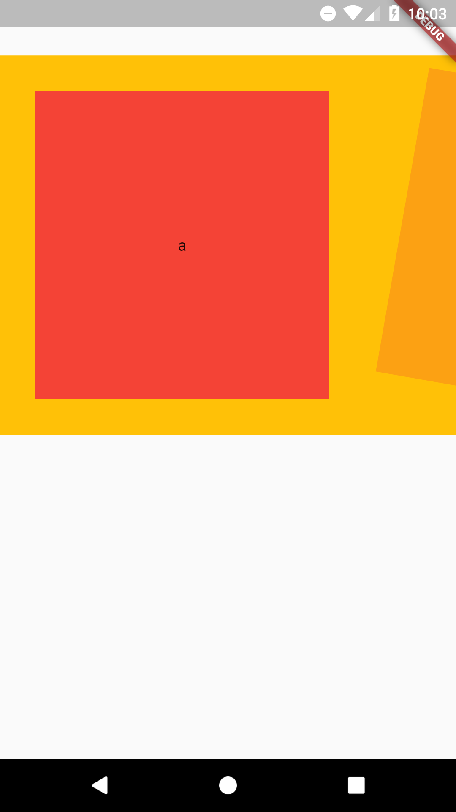
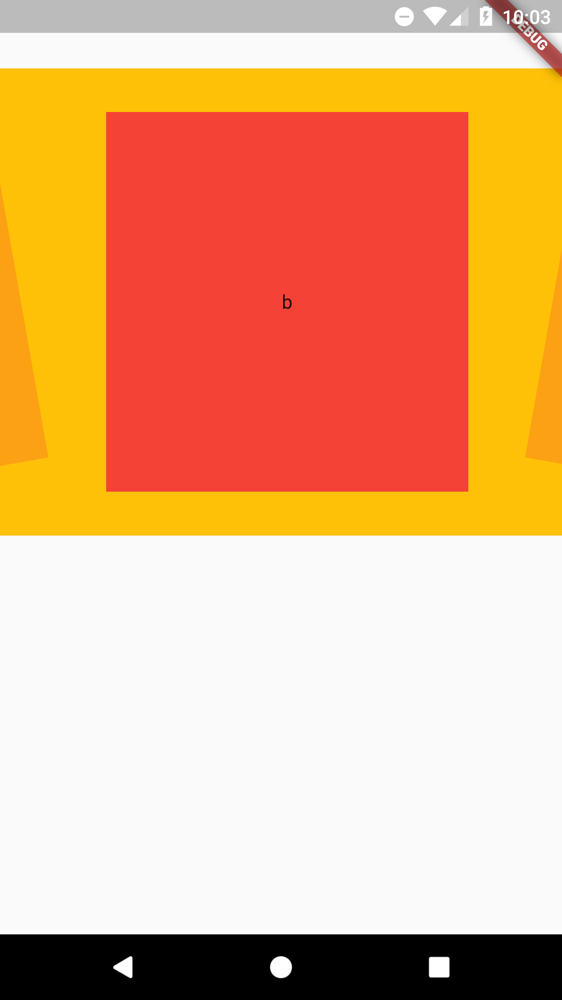
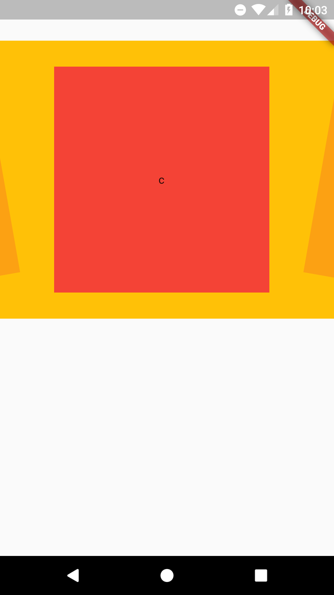
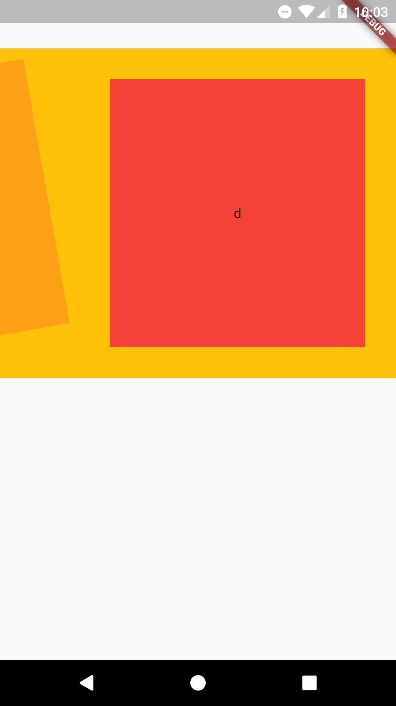

# Rotated List View Flutter
Rotated List View 

The angle of the current visible item will be 0. The previous will be -10 and the next 10 angles. These angles will change as you scroll.

### RotatedListView
  - List<T> dataList : Data List with T type.
  - Function(dynamic, int, int) onChildCreate : Return widget with value, index and listView currentIndex.
  - Function(int) getCurrentClickedItemIndex : Current clicked item index.
  - double visibleFraction : Compare value with visibilityInfo.visibleFraction.
  
### ItemView
  - Widget child : Pass widget.
  - int currentIndex : Current index of visible item.
  - int index : Index of item.
  - int currentItemFraction : Angle of current item.
  - int previousItemFraction : Angle of previous item.
  - int nextItemFraction : Angle of next item.

# Screenshots

